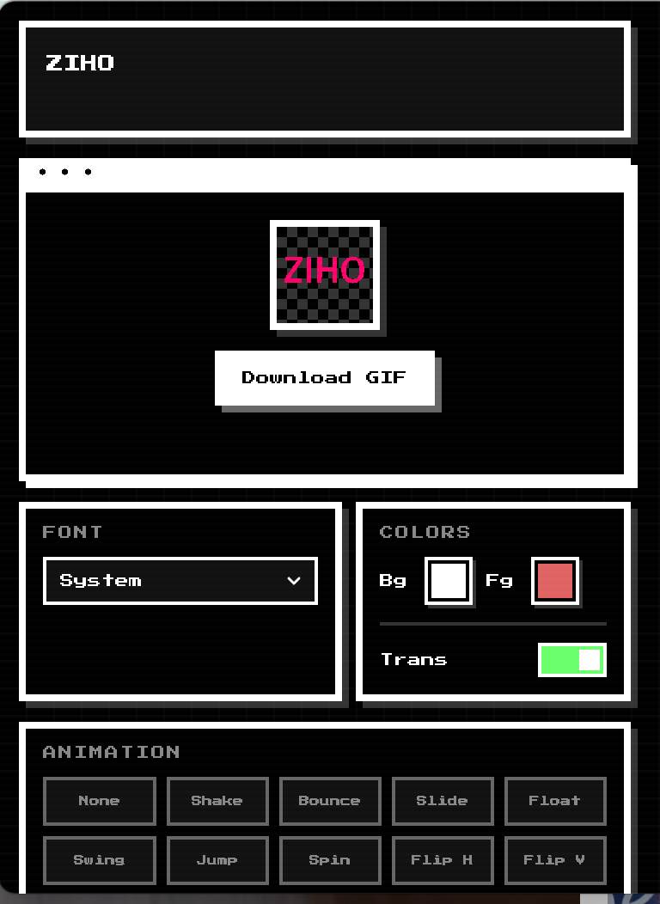

# MOJI

**Create custom Slack emojis from your menu bar in seconds.**

Just type your text and get a Slack-ready emoji. Pick any font, set your colors, choose from 25 animations, and save. No image editor needed — just one click from your menu bar.

<p align="center">
  
</p>

## Features

- **Text to Emoji** — Type text, see a live preview, and save with one click
- **System Fonts** — Use any font installed on your Mac
- **Custom Colors** — Background color, text color, and transparent background toggle
- **25 Animations** — Generate animated GIF emojis instantly
  - Move: shake, bounce, slide, float, swing, jump
  - Rotate: spin, flipH, flipV, wobble, roll
  - Size: pulse, zoomIn, zoomOut, heartbeat, pop
  - Color: party, flash, glow, fade
  - Special: jello, rubberBand, tada, wave
- **PNG / GIF Export** — Static emojis as PNG, animated emojis as GIF
- **Menu Bar App** — Lives in your menu bar, stays out of your Dock

## Usage

1. Click the MOJI icon in the menu bar
2. Type your text
3. Set font, colors, and optionally pick an animation
4. Click **DOWNLOAD** — saved to your Desktop

> Right-click the menu bar icon to quit.

## Installation

### Download DMG

Download the latest `MOJI.dmg` from the [Releases](https://github.com/zih0/moji/releases) page.

> If macOS Gatekeeper blocks the app, run this in your terminal:
>
> ```bash
> xattr -rd com.apple.quarantine /Applications/MOJI.app
> ```

### Build from Source

```bash
git clone https://github.com/user/moji.git
cd moji
npm install
npm run build
```

The `MOJI.dmg` will be generated in the `dist/` directory.

### Development

```bash
npm start
```

## Built with

- [Electron](https://www.electronjs.org/)
- [TypeScript](https://www.typescriptlang.org/)
- [GSAP](https://gsap.com/) — Animation
- [gif.js](https://jnordberg.github.io/gif.js/) — GIF encoding
- [menubar](https://github.com/maxogden/menubar) — Menu bar integration
- [esbuild](https://esbuild.github.io/) — Bundling

## License

ISC
